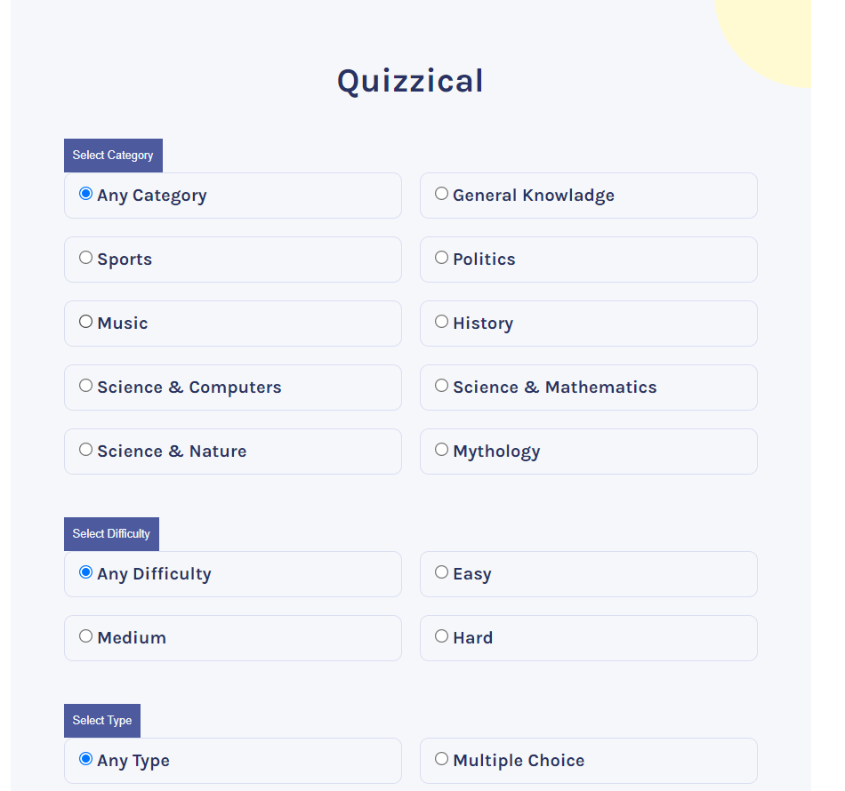
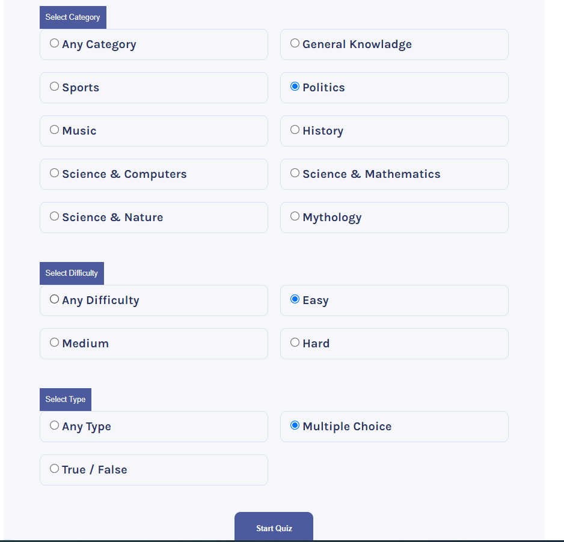
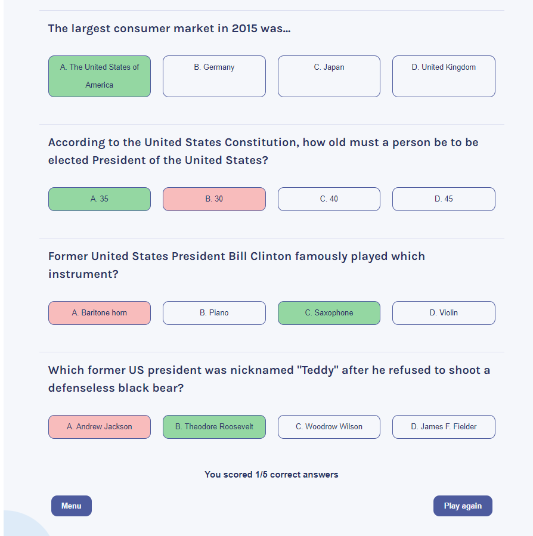

# Quizical App :

<h3>A fun quiz game application to test your geek within !</h3>
 

*This is a solo project from [Scrimba](https://scrimba.com/learn/frontend).*

 

## Quick Tour :

1. User get to select the category, difficulty and type of question.
  

  

2. Thereafter, click on start quiz to get the questions on screen,
  

  

3. Make your selection of answers out of given options
  

  

4. Once you're done with attempt to answer all questiom, click on check answer to get the results
  

  

4. At any point of game user can toggle between the menu or play again after checking answers of previous game
  

### Project is deployed here - [Quizzical](https://cosmic-salmiakki-9a9ecf.netlify.app/).